# **ASGBD - Práctica Grupal 4: Almacenamiento**

## **Parte Grupal - Oracle**

**Tabla de contenidos:**

- [**ASGBD - Práctica Grupal 4: Almacenamiento**](#asgbd---práctica-grupal-4-almacenamiento)
  - [**Parte Grupal - Oracle**](#parte-grupal---oracle)
    - [**Ejercicio 1**](#ejercicio-1)
    - [**Ejercicio 2**](#ejercicio-2)
    - [**Ejercicio 3**](#ejercicio-3)
    - [**Ejercicio 4**](#ejercicio-4)
    - [**Ejercicio 5**](#ejercicio-5)
    - [**Ejercicio 6**](#ejercicio-6)
    - [**Ejercicio 7**](#ejercicio-7)
    - [**Ejercicio 8**](#ejercicio-8)
    - [**Ejercicio 9**](#ejercicio-9)

---

### **Ejercicio 1**

> **1. Cread un índice para la tabla EMP de SCOTT que agilice las consultas por nombre de empleado en un *tablespace* creado específicamente para índices. ¿Dónde deberíais ubicar el fichero de datos asociado? ¿Cómo se os ocurre que podríais probar si el índice resulta de utilidad?**

Al crear un *tablespace*, tenemos que elegir que datafiles vamos a asociarles. Por defecto se guarda en el directorio */opt/oracle/oradata/ORCLCDB*, pero eso lo podemos cambiar según nuestras necesidades, si es un *tablespace* que se use mucho, lo más óptimo sería guardarlo en un SSD ya que tiene mayor velocidad de lectura que los HDD.

1. Ahora insertaremos un millón de registros en la tabla EMP y realizaremos una consulta para ver el tiempo que tarda.

    Lo primero que haré será borrar todos los registros de la tabla emp:

    ```txt
    DELETE FROM EMP;
    ```

    Ahora usaré el siguiente script de PL/SQL para generar cien mil registros:

    ```sql
    CREATE OR REPLACE PROCEDURE add_100000_emp
    AS
    v_nombre emp.ename%TYPE;
    BEGIN
        FOR i IN 1..100000 LOOP
            v_nombre := 'e' || i;
            INSERT INTO emp VALUES (i, v_nombre, 'CLERK', 7902, TO_DATE('01/01/1980', 'DD/MM/YYYY'), 1000, 1000 , 20);
        END LOOP;
    END;
    /
    ```

    Ejecutamos el procedimiento:

    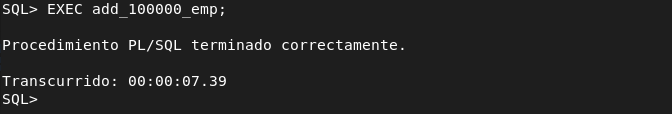

    Y ya tendríamos los cien mil registros en la tabla emp. Ahora para ver el tiempo de ejecución de una consulta, usaremos lo siguiente:

    ```txt
    set timing on;
    ```

    Pruebo con un select para ver cuanto tarda la consulta.

    ```sql
    SELECT JOB FROM EMP WHERE ENAME = 'e99452';
    ```

    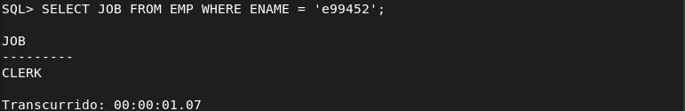

2. Creamos el tablespace donde se guardará el índice.

    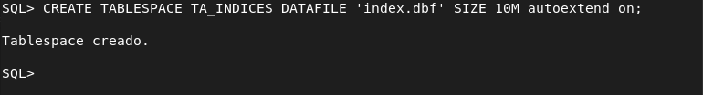

3. Una vez creado el tablespace, crearemos el índice.

    Antes que nada nos conectaremos con el usuario SCOTT:

    ```txt
    alemd@debian:~$ sqlplus
    
    SQL*Plus: Release 19.0.0.0.0 - Production on Wed Feb 1 10:05:13 2023
    Version 19.3.0.0.0
    
    Copyright (c) 1982, 2019, Oracle.  All rights reserved.
    
    Enter user-name: SCOTT
    Enter password: 
    
    ```

    Ahora crearemos el índice:

    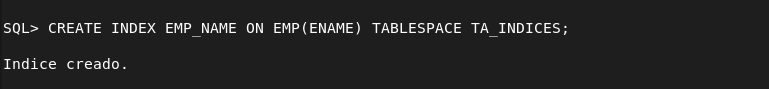

4. Probamos nuevamente a realizar la consulta para ver la mejora de rendimiento:

    Forzaré el uso del índice de la siguiente forma:

    ```sql
    SELECT /*+ INDEX(EMP EMP_NAME)*/ JOB FROM EMP WHERE ENAME='e99452';
    ```

    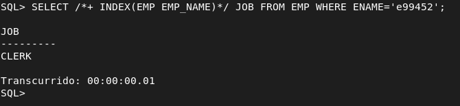

    Como vemos a pasado de tardar un segundo a tardar 1 ms.

### **Ejercicio 2**

> **2. Realizad una consulta al diccionario de datos que muestre qué índices existen para objetos pertenecientes al esquema de SCOTT y sobre qué columnas están definidos. Averiguad en qué fichero o ficheros de datos se encuentran las extensiones de sus segmentos correspondientes.**

Consulta:

```sql
SELECT INDEX_NAME, COLUMN_NAME, TABLE_NAME, TABLE_OWNER
FROM DBA_IND_COLUMNS
WHERE TABLE_OWNER = 'SCOTT'
ORDER BY TABLE_NAME;
```

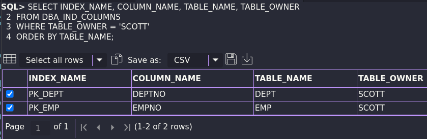

Para averiguar en qué fichero/s se encuentran los *extents* de los segmentos de los índices, podemos utilizar la siguiente consulta:

```sql
SELECT FILE_NAME, TABLESPACE_NAME
FROM DBA_DATA_FILES
WHERE TABLESPACE_NAME = (
    SELECT DISTINCT TABLESPACE_NAME
    FROM DBA_SEGMENTS
    WHERE SEGMENT_TYPE = 'INDEX's
    AND OWNER = 'SCOTT');
```

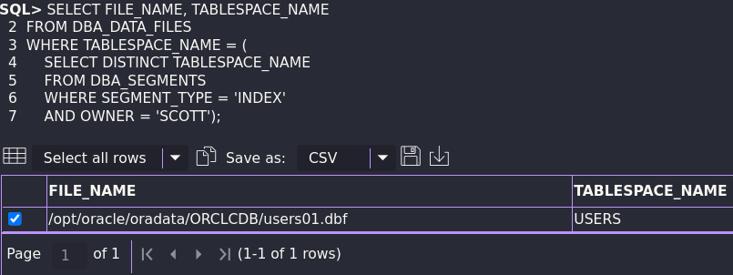

### **Ejercicio 3**

> **3. Cread una secuencia para rellenar el campo *deptno* de la tabla dept de forma coherente con los datos ya existentes. Insertad al menos dos registros haciendo uso de la secuencia.**

Creamos la tabla DEPT:

```sql
CREATE TABLE DEPT (
  DEPTNO NUMBER(2) CONSTRAINT PK_DEPT PRIMARY KEY,
  DNAME VARCHAR2(14),
  LOC VARCHAR2(13));
```

Insertamos los registros por defecto:

```sql
INSERT INTO DEPT VALUES (10,'ACCOUNTING','NEW YORK');
INSERT INTO DEPT VALUES (20,'RESEARCH','DALLAS');
INSERT INTO DEPT VALUES (30,'SALES','CHICAGO');
INSERT INTO DEPT VALUES (40,'OPERATIONS','BOSTON');
```

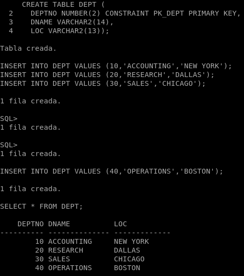

Creamos la secuencia:

```sql
CREATE SEQUENCE DEPTNO_sec
START WITH 50
INCREMENT BY 10;
```
Como hemos podido ver al añadir los registros, el valor de este campo incrementa de 10 en 10 y el valor máximo es 40. Por lo tanto hemos creado una secuencia que comience a partir del 50 incrementando 10 por cada fila.

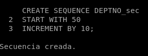

Insertamos dos nuevos registros para comprobar el correcto funcionamiento:

```sql
INSERT INTO DEPT (DEPTNO, DNAME, LOC)
VALUES (DEPTNO_sec.NEXTVAL, 'FINANZAS', 'DOS HERMANAS');

INSERT INTO DEPT (DEPTNO, DNAME, LOC)
VALUES (DEPTNO_sec.NEXTVAL, 'TIC', 'CHILE');
```

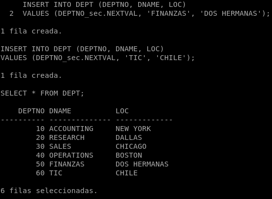

### **Ejercicio 4**

> **4. Queremos limpiar nuestro fichero *tnsnames.ora*. Averiguad cuales de sus entradas se están usando en algún enlace de la base de datos.**

Para poder limpiar el fichero *tnsnames.ora*, primero debemos averiguar qué entradas se están usando en algún enlace. Para ello, podemos utilizar la siguiente consulta:

```sql
SELECT *
FROM DBA_DB_LINKS;
```

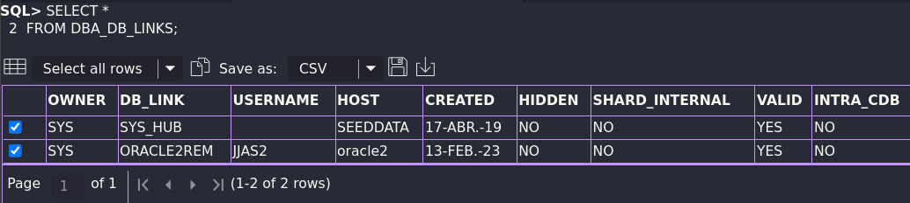

Sabemos entonces que se está usando el enlace *ORACLE2REM* aparte del definido por el sistema de forma automática *SYS_HUB*. Por lo tanto, podremos eliminar las entradas de *tnsnames.ora* que no hayan aparecido en la consulta ya que serán aquellas que no están en uso.

Para editar el fichero:

```bash
nano -cl $ORACLE_HOME/network/admin/tnsnames.ora
```

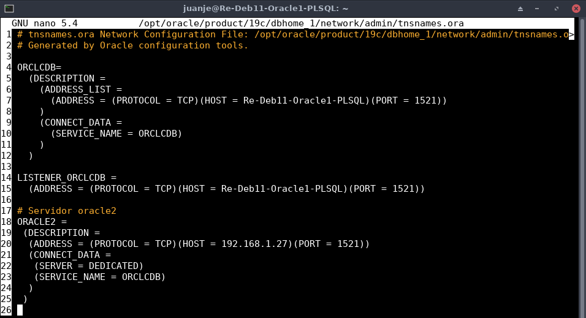

Y eliminaríamos las entradas que no estén en uso, en este caso no sería necesario eliminar ninguna del fichero.

### **Ejercicio 5**

> **5. Meted las tablas EMP y DEPT de SCOTT en un cluster.**

Creamos el cluster:

```sql
CREATE CLUSTER cluster_dept_emp (DEPTNO NUMBER(2)) SIZE 300;
```

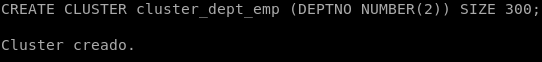

Creamos un index para el cluster:

```sql
CREATE INDEX index_c_EmpDept ON CLUSTER cluster_dept_emp;
```

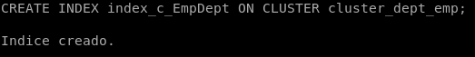

Creamos las tablas en el cluster añadiendo la línea "CLUSTER NOMBRE_CLUSTER (CAMPO);":

```sql
CREATE TABLE DEPT (
        DEPTNO NUMBER(2) CONSTRAINT PK_DEPT PRIMARY KEY,
        DNAME VARCHAR2(14),
        LOC VARCHAR2(13))
        CLUSTER cluster_dept_emp (DEPTNO);

CREATE TABLE EMP (
        EMPNO NUMBER(4) CONSTRAINT PK_EMP PRIMARY KEY,
        ENAME VARCHAR2(10),
        JOB VARCHAR2(9),
        MGR NUMBER(4),
        HIREDATE DATE,
        SAL NUMBER(7,2),
        COMM NUMBER(7,2),
        DEPTNO NUMBER(2) CONSTRAINT FK_DEPTNO REFERENCES DEPT)
        CLUSTER cluster_dept_emp (DEPTNO);
```

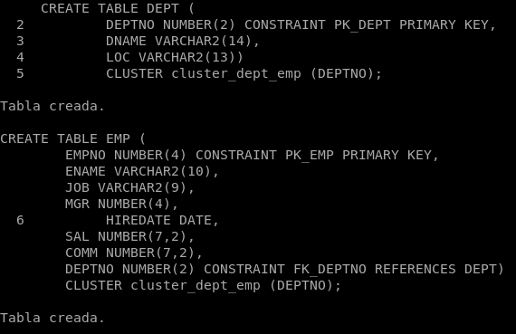

E insertamos los datos en las nuevas tablas:

```sql
INSERT INTO DEPT VALUES (10,'ACCOUNTING','NEW YORK');
INSERT INTO DEPT VALUES (20,'RESEARCH','DALLAS');
INSERT INTO DEPT VALUES (30,'SALES','CHICAGO');
INSERT INTO DEPT VALUES (40,'OPERATIONS','BOSTON');

INSERT INTO EMP VALUES (7369,'SMITH','CLERK',7902,to_date('17-12-1980','dd-mm-yyyy'),800,NULL,20);
INSERT INTO EMP VALUES (7499,'ALLEN','SALESMAN',7698,to_date('20-2-1981','dd-mm-yyyy'),1600,300,30);
INSERT INTO EMP VALUES (7521,'WARD','SALESMAN',7698,to_date('22-2-1981','dd-mm-yyyy'),1250,500,30);
INSERT INTO EMP VALUES (7566,'JONES','MANAGER',7839,to_date('2-4-1981','dd-mm-yyyy'),2975,NULL,20);
INSERT INTO EMP VALUES (7654,'MARTIN','SALESMAN',7698,to_date('28-9-1981','dd-mm-yyyy'),1250,1400,30);
```

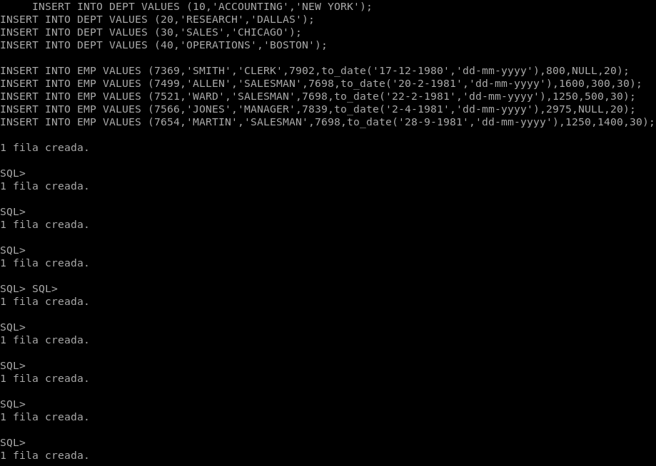

### **Ejercicio 6**

> **6. Realizad un procedimiento llamado *BalanceoCargaTemp* que balancee la carga de usuarios entre los tablespaces temporales existentes. Para ello averiguará cuántos existen y asignará los usuarios entre ellos de forma equilibrada. Si es necesario para comprobar su funcionamiento, crea tablespaces temporales nuevos.**

1. Nos conectaremos como administrador y habilitamos la salida por pantalla de DBMS.

    ```sql
    sqlplus / as sysdba
    set serveroutput on;
    ```

2. Crearemos 2 tablespace temporales, temp1 y temp2.

    Para ello ejecutamos lo siguiente:

    ```sql
    CREATE TEMPORARY TABLESPACE temp1
    TEMPFILE 'temp1'
    SIZE 15M
    AUTOEXTEND ON;

    CREATE TEMPORARY TABLESPACE temp2
    TEMPFILE 'temp2'
    SIZE 15M
    AUTOEXTEND ON;
    ```

3. Creamos los módulos de programación necesarios para la resolución del ejercicio.

    ```sql
    CREATE OR REPLACE PROCEDURE P_ASIGNAUSUARIO (P_USUARIO DBA_USERS.USERNAME%TYPE, P_TABLESPACE DBA_TABLESPACES.TABLESPACE_NAME%TYPE)
    IS
    BEGIN
        EXECUTE IMMEDIATE 'ALTER USER ' || P_USUARIO || ' TEMPORARY TABLESPACE ' || P_TABLESPACE;
    END;
    /

    CREATE OR REPLACE PROCEDURE BALANCEOTABLESPACE
    IS
    	CURSOR C_USERS IS
    	SELECT DISTINCT U.USERNAME
        FROM DBA_USERS U, V$TEMP_SPACE_HEADER T
        WHERE U.ACCOUNT_STATUS = 'OPEN'
        AND U.TEMPORARY_TABLESPACE = T.TABLESPACE_NAME;
        CURSOR C_TMTS
        IS
        SELECT DISTINCT TABLESPACE_NAME
        FROM v$TEMP_SPACE_HEADER;
        V_USUARIOS C_USERS%ROWTYPE;
    BEGIN
        OPEN C_USERS;
        FOR V_TABLESPACE IN C_TMTS LOOP
            FETCH C_USERS INTO V_USUARIOS;
            P_ASIGNAUSUARIO (V_USUARIOS.USERNAME, V_TABLESPACE.TABLESPACE_NAME);
            IF C_TMTS%NOTFOUND THEN
                CLOSE C_USERS;
                OPEN C_USERS;
            END IF;
        END LOOP;
    END;
    /

    CREATE OR REPLACE PROCEDURE BALANCEOUSERS
    IS
    	CURSOR C_USERS IS
    	SELECT DISTINCT U.USERNAME
        FROM DBA_USERS U, V$TEMP_SPACE_HEADER T
        WHERE U.ACCOUNT_STATUS = 'OPEN'
        AND U.TEMPORARY_TABLESPACE = T.TABLESPACE_NAME;
        CURSOR C_TMTS
        IS
        SELECT DISTINCT TABLESPACE_NAME
        FROM v$TEMP_SPACE_HEADER;
        V_TABLESPACE C_TMTS%ROWTYPE;
    BEGIN
        OPEN C_TMTS;
        FOR V_USUARIOS IN C_USERS LOOP
            FETCH C_TMTS INTO V_TABLESPACE;
            P_ASIGNAUSUARIO (V_USUARIOS.USERNAME, V_TABLESPACE.TABLESPACE_NAME);
            IF C_TMTS%NOTFOUND THEN
                CLOSE C_TMTS;
                OPEN C_TMTS;
            END IF;
        END LOOP;
    END;
    /

    CREATE OR REPLACE FUNCTION P_NUMUSUARIOS
    RETURN NUMBER
    IS
        V_NUMUSERS     NUMBER;
    BEGIN
        SELECT COUNT(U.USERNAME) INTO V_NUMUSERS
        FROM DBA_USERS U, V$TEMP_SPACE_HEADER T
        WHERE U.ACCOUNT_STATUS = 'OPEN'
        AND U.TEMPORARY_TABLESPACE = T.TABLESPACE_NAME;
        RETURN V_NUMUSERS;
    END P_NUMUSUARIOS;
    /

    CREATE OR REPLACE FUNCTION P_NUMTABLESPACE
    RETURN NUMBER
    IS
        V_NUMTS     NUMBER;
    BEGIN
        SELECT COUNT(DISTINCT TABLESPACE_NAME) 
        INTO V_NUMTS FROM v$TEMP_SPACE_HEADER;
        RETURN V_NUMTS;
    END P_NUMTABLESPACE;
    /

    CREATE OR REPLACE PROCEDURE BALANCEOCARGATEMP
    IS
    BEGIN
        IF P_NUMTABLESPACE > P_NUMUSUARIOS THEN
            BALANCEOTABLESPACE;
        ELSE
            BALANCEOUSERS;
        END IF;
    END;
    /
    ```

4. Comprobación del correcto funcionamiento:

    Primero muestro los usuarios y los tablespace temporales de cada usuario.

    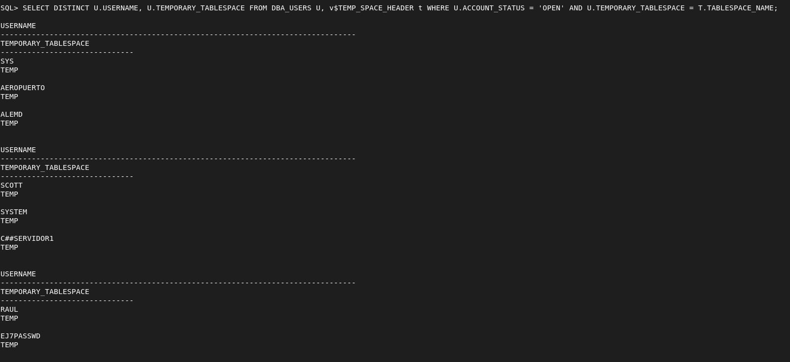

    Ejecuto el procedimiento y vuelvo a mostrar la consulta con el usuario y el tablespace temporal al que pertenece:

    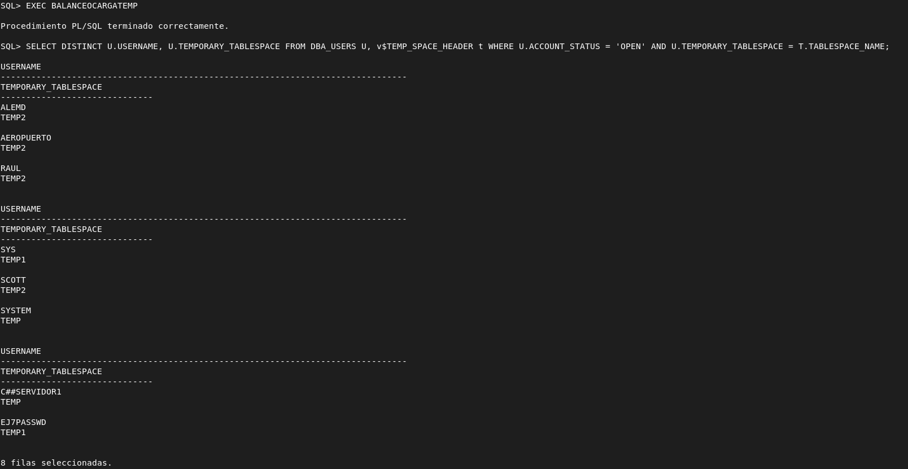

### **Ejercicio 7**

> **7. Explicad en qué consiste el sharding en MongoDB. Intentad montarlo.**

```sql
```

### **Ejercicio 8**

> **8. Exento por falta de un integrante del grupo.**

### **Ejercicio 9**

> **9. Elaboración de un vídeo grupal resumiendo las diferencias de concepto y en la gestión de espacios de tabla, índices, claúsulas de almacenamiento y segmentos y extensiones entre los cuatro SGBDs estudiados. Cada miembro del grupo hablará de uno de los siguientes temas:**
> **a) Espacios de Tabla y cuotas de uso de los mismos.**
> **b) Índices. Secuencias.**
> **c) Cláusulas de Almacenamiento.**
> **d) Segmentos y Extensiones. Clusters de tablas.**

---

✒️ **Documentación realizada por Paco Diz Ureña.**
✒️ **Documentación realizada por Alejandro Montes Delgado.**
✒️ **Documentación realizada por Juan Jesús Alejo Sillero.**
